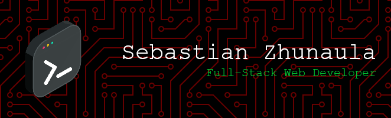

<!-- 
 
 
 
 
 
 
 
 
 
 
 
 
 
 
 
 
 
 
 
 
 
 
 
-->

# Hello world 👋, I'm Sebastian

# Sobre mi

Soy un **Desarrollador Full-Stack** con experiencia en **programación**, **ciberseguridad** y **diseño gráfico**. Me apasiona crear aplicaciones web, desarrollar soluciones escalables y optimizar la experiencia del usuario.

 

# 🛠️ Languages and Tools:

